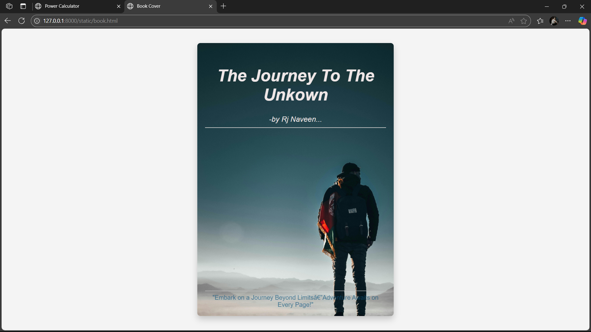

# Ex.06 Book Front Cover Page Design
# Date:14-11-2024
# AIM:
To design a book front cover page using HTML and CSS.

# DESIGN STEPS:
## Step 1:
Create a Django Admin project.

## Step 2:
Create an app in the Django interface.

## Step 3:
Create a folder named 'static' in the app folder.

## Step 4:
Create a new HTML file in the static folder.

## Step 5:
Write the HTML code with relevant CSS properties.

## Step 6:
Choose the appropriate style and color scheme.

## Step 7:
Insert the images in their appropriate places.

## Step 8:
Publish the website in the LocalHost.

# PROGRAM:
```
<!DOCTYPE html>
    <html>
       <head>
  <title>Book Cover</title>
  <style>
    body {
      display: flex;
      justify-content: center;
      align-items: center;
      height: 100vh;
      margin: 0;
      background-color: #f4f4f4;
      font-family: 'Arial', sans-serif;
    }
    
    .book-cover {
    width: 470px;
    height: 670px;
    background-image: url(https://images.pexels.com/photos/1576939/pexels-photo-1576939.jpeg?cs=srgb&dl=pexels-sulimansallehi-1576939.jpg&fm=jpg);
    background-size: 720px;
    background-repeat: no-repeat;
     box-shadow: 0 8px 16px rgba(0, 0, 0, 0.2);
    border-radius: 8px;
     display: flex;
    flex-direction: column;
     justify-content: space-between;
    padding: 20px;
     color: rgb(238, 230, 230);
    text-align: center;
    }
    
        .title {
        font-size: 2.7em;
        font-weight: bold;
        margin-top: 40px;
        font-style:italic;
    }
    
    .author {
          font-size: 1.2em;
          margin-bottom:400px;
          font-style: italic;
    }
    
    .bottom-text {
              font-size: 1em;
              opacity: 0.7;
              color: black;
    }
    </style>
</head>
<body>
  <div class="book-cover">
    <div class="title">The Journey To The Unkown</div>
    
    <div class="author"><br>-by Rj Naveen... <hr> </div>

    <div class="bottom-text" style="color: rgb(8, 83, 126);"><hr>"Embark on a Journey Beyond Limits—Adventure Awaits on Every Page!"</div>
  </div>
  
</body>
</html>

```


# OUTPUT:

# RESULT:
The program for designing book front cover page using HTML and CSS is completed successfully.
